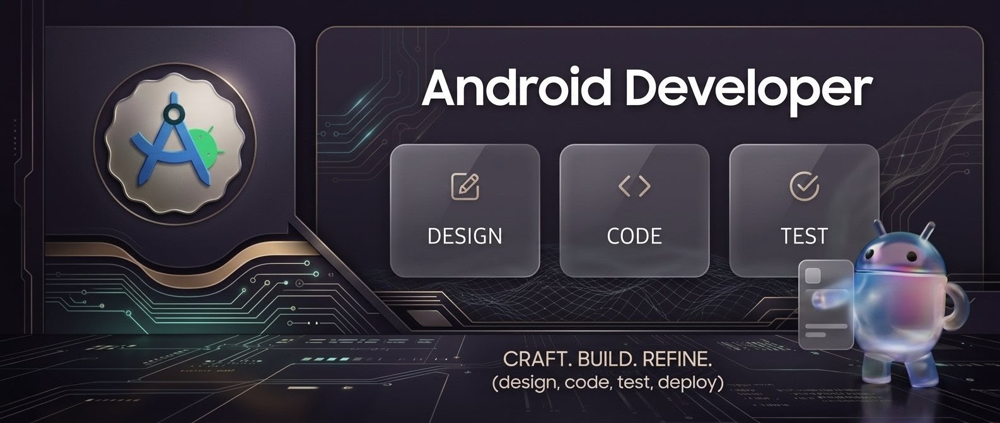

  

# Hi, I'm Praveen 👋

### Android Engineer | Kotlin • Jetpack Compose • Backend • AI/ML

Building modern, scalable Android applications with clean architecture and intelligent experiences.

---

## 🌐 Connect with me:

&nbsp;

---

## 💻 Tech Stack:

### 🤖 UI & Frameworks
* **UI Development:** Modern declarative UI with **Jetpack Compose**

  
  

### ⚙️ Backend

  

### 🌐 API Integration
* **Expertise:** REST APIs, Retrofit

  

### 🗄️ Database

  

### 🛠️ Tools & Design (AI/ML)

  
  
  

---

## 📊 GitHub Stats:

  
  

 

  

---

  

